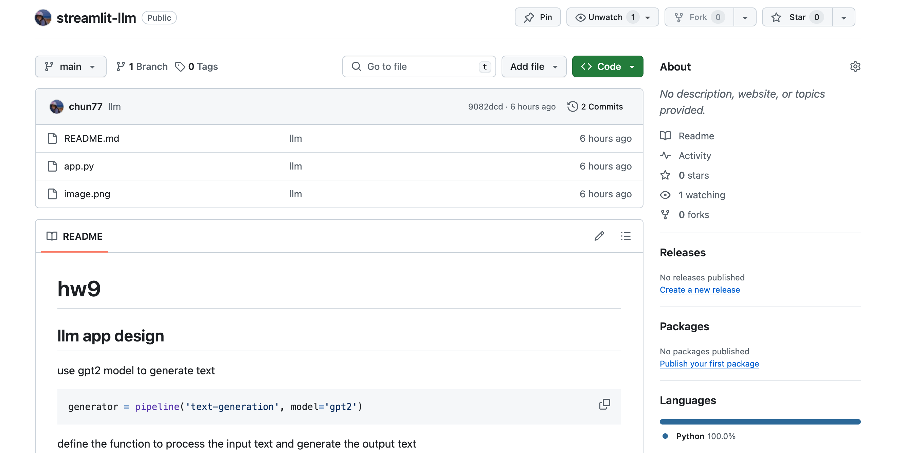
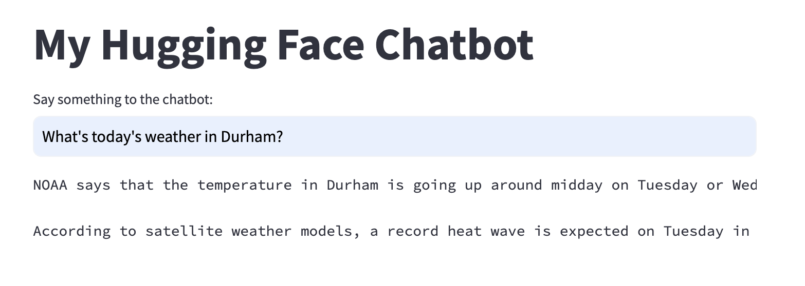

# hw9

[my llm app](https://app-llm-ids-hw9.streamlit.app/)


## llm app design
use gpt2 model to generate text
```python
generator = pipeline('text-generation', model='gpt2')
```
define the function to process the input text and generate the output text
1. Add conversational context to the prompt
2. Check if the prompt is in the generated text and remove it
3. Remove only the exact user input if found at the start
```python
def process_response(input_text, generated_text):
    # Add conversational context to the prompt
    prompt = f"Human: {input_text}\nAI:"
    
    # Check if the prompt is in the generated text and remove it
    if prompt in generated_text:
        return generated_text.replace(prompt, '').strip()
    
    # Remove only the exact user input if found at the start
    if generated_text.startswith(input_text):
        return generated_text[len(input_text):].strip()
    
    # Return the original generated text if no repetition is found
    return generated_text
```

## deploy the app
1. import the repo to github


## Test


